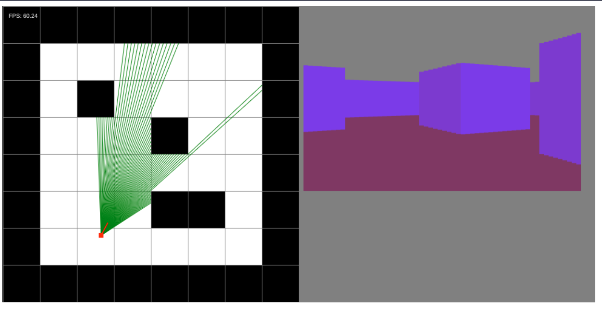

# Simple raycasting engine in TypeScript

This projet aims to learn more about raycasting by implementing a simple raycasting engine in TypeScript.

Try it out [here](https://matthieuflaceliere.github.io/RaycastingJS/).

## How to run

1. Clone the repository
2. Run `npm install`
3. Run `npm run dev`

## References

[3DSage](https://www.youtube.com/watch?v=gYRrGTC7GtA)\
[Austin Z. Henley](https://austinhenley.com/blog/raycasting.html) \
[Lode's Computer Graphics Tutorial](https://lodev.org/cgtutor/raycasting.html)